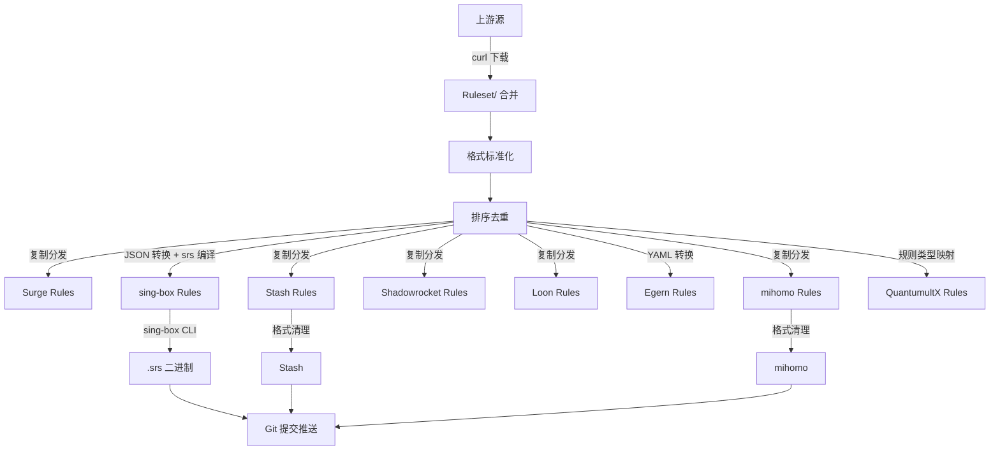

# Tool

> 跨平台代理规则集与配置方案 · 自动化构建 · 生产就绪

---

> [!Caution]
> **禁止任何形式的转载或发布至国内平台**

> [!WARNING]
> **禁止 FORK**

> [!IMPORTANT]
> 任何以任何方式查看此项目的人或直接或间接使用该项目的使用者都应仔细阅读此声明。
>
> 保留随时更改或补充此免责声明的权利。
>
> 一旦使用并复制了该项目的任何文件，则视为您已接受此免责声明。

---

## 📋 目录

- [概览](#-概览)
- [支持的平台](#-支持的平台)
- [目录结构](#-目录结构)
- [规则集说明](#-规则集说明)
- [客户端配置](#-客户端配置)
- [服务端配置](#-服务端配置)
- [Surge 模块](#-surge-模块)
- [自动化构建](#-自动化构建)
- [GeoIP 数据库](#-geoip-数据库)
- [自定义规则](#-自定义规则)
- [使用方法](#-使用方法)
- [更新日志](#-更新日志)
- [免责申明](#-免责申明)

---

## 📖 概览

[`Tool`](.) 是一套 **多平台代理规则集与配置方案**，覆盖主流代理客户端。项目通过 [`GitHub Actions`](.github/workflows/Build.yml) **每日自动构建**，从多个上游源（ACL4SSR、blackmatrix7、SukkaW、Loyalsoldier 等）同步规则，经标准化处理后分发至各平台。

### 核心特性

| 特性 | 说明 |
|------|------|
| **多平台覆盖** | Surge / mihomo / Stash / Egern / Shadowrocket / Quantumult X / Loon / sing-box / Surfboard / LanceX |
| **规则统一** | 上游多源合并 → 标准化 `.list` → 自动分发至各平台 |
| **格式转换** | `.list` → `.yaml`(Egern) / `.json`+`.srs`(sing-box) / `.conf`(Surge/QX) |
| **自动构建** | 每日 UTC 00:05 / 12:05 两次构建，自定义规则推送触发增量构建 |
| **高频更新** | 规则集与上游源保持同步，始终保持最新 |
| **生产就绪** | 开箱即用的客户端配置，含策略组、DNS、TUN 等完整方案 |

---

## 🎯 支持的平台

| 平台 | 配置文件 | 规则格式 | 最低版本 |
|------|---------|---------|---------|
| [`Surge`](Surge/) | [`Surge.conf`](Surge/Surge.conf) | `.list` | Mac ≥ 6.6.0 / iOS ≥ 5.101.0 |
| [`mihomo`](mihomo/) | [`config.yaml`](mihomo/Client/config.yaml) | `.list` | ≥ 1.19.23 |
| [`Stash`](Stash/) | [`Stash.yaml`](Stash/Stash.yaml) | `.list` | ≥ 2.6.0 |
| [`Egern`](Egern/) | [`Egern.yaml`](Egern/Egern.yaml) | `.yaml` | ≥ 2.0.0 |
| [`Shadowrocket`](Shadowrocket/) | [`Shadowrocket.conf`](Shadowrocket/Shadowrocket.conf) | `.list` | latest |
| [`Quantumult X`](QuantumultX/) | [`QuantumultX.conf`](QuantumultX/QuantumultX.conf) | `.list` | latest |
| [`Loon`](Loon/) | [`Loon.conf`](Loon/Loon.conf) | `.list` | latest |
| [`sing-box`](sing-box/) | [`config.json`](sing-box/v1.14.x/config.json) | `.json` + `.srs` | latest |
| [`Surfboard`](Surfboard/) | [`Surfboard.conf`](Surfboard/Surfboard.conf) | `.list` | latest |
| [`LanceX`](LanceX/) | [`LanceX.conf`](LanceX/LanceX.conf) | `.list` | latest |

---

## 🗂️ 目录结构

```
Tool/
├── Surge/                    # Surge 配置 & 规则
│   ├── Surge.conf            # 主配置（策略组 + 规则引用）
│   ├── Rules/                # 规则集（.list）
│   ├── Module/               # Surge 模块
│   │   ├── Function/         # 功能模块（DNS、Q-Search 等）
│   │   ├── NoAds/            # 去广告模块
│   │   └── README.md
│   ├── Custom/               # 自定义规则源
│   ├── Script/               # Surge 脚本
│   └── ...
├── mihomo/                   # mihomo / Clash Meta
│   ├── Client/
│   │   ├── config.yaml       # 客户端配置
│   │   ├── Lite/             # 轻量版客户端配置
│   │   └── Override/         # 覆写脚本
│   ├── Rules/                # 规则集（.list）
│   └── Server/               # 服务端配置
│       ├── Hysteria2/
│       ├── SS2022/
│       └── anyTLS/
├── Stash/                    # Stash 配置
│   ├── Stash.yaml            # 主配置
│   ├── Stash_lite.yaml       # 轻量版
│   ├── Rules/                # 规则集（.list）
│   └── Override/             # 覆写（.stoverride）
├── Egern/                    # Egern 配置
│   ├── Egern.yaml            # 主配置
│   ├── Rules/                # 规则集（.yaml）
│   └── Module/               # 模块
├── Shadowrocket/             # Shadowrocket 配置
│   ├── Shadowrocket.conf     # 主配置
│   └── Rules/                # 规则集（.list）
├── QuantumultX/              # Quantumult X 配置
│   ├── QuantumultX.conf      # 主配置
│   ├── Rewrite/              # 重写规则
│   └── Rules/                # 规则集（.list）
├── Loon/                     # Loon 配置
│   ├── Loon.conf             # 主配置
│   └── ...
├── sing-box/                 # sing-box 配置
│   ├── v1.13.x/
│   ├── v1.14.x/
│   │   ├── config.json       # 主配置
│   │   ├── Client/           # 客户端配置
│   │   └── Server/           # 服务端配置
│   └── Rules/                # 规则集（.json + .srs）
├── Surfboard/                # Surfboard 配置
├── LanceX/                   # LanceX 配置
├── GeoIP/                    # GeoIP 数据库
│   ├── CN_Country.mmdb       # 中国 IP（仅境内 + 私有）
│   ├── Global_Country.mmdb   # 全球 IP
│   └── README.md
├── .github/workflows/
│   └── Build.yml             # CI/CD 自动构建
└── vps/                      # VPS 相关
```

---

## 📦 规则集说明

规则集每日从上游源同步，经过**标准化 → 排序去重 → 平台分发**流程，确保各平台规则一致。

### 规则覆盖范围

| 类别 | 规则集文件 | 说明 |
|------|-----------|------|
| **广告拦截** | [`Reject`](Surge/Rules/Reject.list)、[`Ads_SukkaW`](Surge/Rules/Ads_SukkaW.list)、[`Ads_AWAvenue`](Surge/Rules/Ads_AWAvenue.list)、[`Ads_limbopro`](Surge/Rules/Ads_limbopro.list)、[`Ads_EasyListChina`](Surge/Rules/Ads_EasyListChina.list)、[`Ads_EasyListPrivacy`](Surge/Rules/Ads_EasyListPrivacy.list)、[`Ads_Dlerio`](Surge/Rules/Ads_Dlerio.list)、[`AdGuardChinese`](Surge/Rules/AdGuardChinese.list)、[`Ads_DiDiChuXing`](Surge/Rules/Ads_DiDiChuXing.list) | 多源聚合广告拦截 |
| **AI 服务** | [`AI`](Surge/Rules/AI.list)、[`OpenAI`](Surge/Rules/OpenAI.list)、[`Claude`](Surge/Rules/Claude.list)、[`xAI`](Surge/Rules/xAI.list) | ChatGPT、Claude、Grok 等 |
| **Apple 服务** | [`Apple`](Surge/Rules/Apple.list)、[`AppleCN`](Surge/Rules/AppleCN.list)、[`AppleProxy`](Surge/Rules/AppleProxy.list)、[`AppleServers`](Surge/Rules/AppleServers.list)、[`AppleMedia`](Surge/Rules/AppleMedia.list)、[`AppleMusic`](Surge/Rules/AppleMusic.list)、[`AppleID`](Surge/Rules/AppleID.list)、[`AppStore`](Surge/Rules/AppStore.list)、[`iCloud`](Surge/Rules/iCloud.list)、[`TestFlight`](Surge/Rules/TestFlight.list)、[`FitnessPlus`](Surge/Rules/FitnessPlus.list) | 苹果生态全覆盖 |
| **流媒体** | [`Netflix`](Surge/Rules/Netflix.list)、[`Disney`](Surge/Rules/Disney.list)、[`HBO`](Surge/Rules/HBO.list)、[`PrimeVideo`](Surge/Rules/PrimeVideo.list)、[`Bahamut`](Surge/Rules/Bahamut.list)、[`Spotify`](Surge/Rules/Spotify.list)、[`YouTube`](Surge/Rules/YouTube.list)、[`TikTok`](Surge/Rules/TikTok.list)、[`Emby`](Surge/Rules/Emby.list) | 国际流媒体平台 |
| **社交媒体** | [`Twitter`](Surge/Rules/Twitter.list)、[`Instagram`](Surge/Rules/Instagram.list)、[`Facebook`](Surge/Rules/Facebook.list)、[`Telegram`](Surge/Rules/Telegram.list) | 社交平台 |
| **游戏平台** | [`Steam`](Surge/Rules/Steam.list)、[`Epic`](Surge/Rules/Epic.list)、[`Game`](Surge/Rules/Game.list)、[`Xbox`](Surge/Rules/Xbox.list) | 游戏商店与平台 |
| **微软服务** | [`Microsoft`](Surge/Rules/Microsoft.list)、[`OneDrive`](Surge/Rules/OneDrive.list)、[`Github`](Surge/Rules/Github.list) | 微软系服务 |
| **谷歌服务** | [`Google`](Surge/Rules/Google.list) | 谷歌系服务 |
| **国内规则** | [`ChinaDomain`](Surge/Rules/ChinaDomain.list)、[`ChinaIP`](Surge/Rules/ChinaIP.list)、[`ChinaASN`](Surge/Rules/ChinaASN.list)、[`Bilibili`](Surge/Rules/Bilibili.list)、[`WeChat`](Surge/Rules/WeChat.list) | 中国大陆直连规则 |
| **代理规则** | [`Proxy`](Surge/Rules/Proxy.list)、[`ProxyGFW`](Surge/Rules/ProxyGFW.list)、[`ProxyMedia`](Surge/Rules/ProxyMedia.list) | 通用代理规则 |
| **直连规则** | [`Direct`](Surge/Rules/Direct.list)、[`Lan`](Surge/Rules/Lan.list) | 直连 & 局域网 |
| **下载 CDN** | [`DownloadCDN_CN`](Surge/Rules/DownloadCDN_CN.list)、[`DownloadCDN_Global`](Surge/Rules/DownloadCDN_Global.list) | 下载加速域名 |
| **其他** | [`CDN`](Surge/Rules/CDN.list)、[`Cloudflare`](Surge/Rules/Cloudflare.list)、[`Crypto`](Surge/Rules/Crypto.list)、[`Oracle`](Surge/Rules/Oracle.list)、[`PayPal`](Surge/Rules/PayPal.list)、[`Porn`](Surge/Rules/Porn.list)、[`APNs`](Surge/Rules/APNs.list)、[`Prevent_DNS_Leaks`](Surge/Rules/Prevent_DNS_Leaks.list)、[`FILTER_REGION`](Surge/Rules/FILTER_REGION.list) | 专项规则 |

---

## 🚀 客户端配置

各平台均提供开箱即用的配置文件，内置完整的策略组体系和规则引用。

### 策略组架构

所有平台的策略组设计保持一致，便于多平台切换时理解：

```
┌─ 手动选择 ──┐  ← 全局手动切换
├─ 国外网站    │  ← 通用代理分流
├─ 国际媒体    │  ← Netflix / Disney+ / HBO 等
├─ 微软服务    │  ← Microsoft / GitHub / OneDrive
├─ 谷歌服务    │  ← Google / YouTube
├─ 社交媒体    │  ← Twitter / Instagram / TikTok
├─ 电报消息    │  ← Telegram
├─ AI          │  ← ChatGPT / Claude / xAI
├─ 游戏平台    │  ← Steam / Epic / Xbox
├─ Emby        │  ← 私人媒体库
├─ Spotify     │  ← 流媒体音乐
├─ 兜底分流    │  ← 未匹配规则的兜底策略
├─ 香港节点    │  ┐
├─ 美国节点    │  ├─ 按地区自动测速优选
├─ 狮城节点    │  │  (url-test / smart)
├─ 日本节点    │  │
└─ 台湾节点    │  ┘
```

### 快速开始

1. **选择平台**：进入对应平台目录获取配置
2. **修改订阅 URL**：将配置中的 `http://your-service-provider` 替换为你的机场订阅链接
3. **导入客户端**：以 Surge 为例：
   - 打开 Surge → 配置 → 从 URL 下载配置
   - 输入 [`https://raw.githubusercontent.com/Repcz/Tool/X/Surge/Surge.conf`](https://raw.githubusercontent.com/Repcz/Tool/X/Surge/Surge.conf)
   - 修改 `subscribe-url` 为你的订阅地址

---

## 🖥️ 服务端配置

[`mihomo/Server/`](mihomo/Server/) 目录下提供多协议服务端配置模板：

| 协议 | 路径 | 说明 |
|------|------|------|
| **Hysteria2** | [`mihomo/Server/Hysteria2/config.yaml`](mihomo/Server/Hysteria2/config.yaml) | 基于 QUIC 的高速传输协议 |
| **SS2022** | [`mihomo/Server/SS2022/config.yaml`](mihomo/Server/SS2022/config.yaml) | Shadowsocks 2022 加密方案 |
| **anyTLS** | [`mihomo/Server/anyTLS/config.yaml`](mihomo/Server/anyTLS/config.yaml) | 任意 TLS 伪装代理 |

同时 [`sing-box/v1.14.x/Server/`](sing-box/v1.14.x/Server/) 下提供 sing-box 服务端配置模板（含 anyTLS 方案）。

---

## 🔄 自动化构建

项目通过 [`GitHub Actions`](.github/workflows/Build.yml) 实现全自动规则更新流水线。

### 构建流程



### 构建步骤详解

| 步骤 | 名称 | 说明 |
|------|------|------|
| 1 | [`Checkout Repository`](.github/workflows/Build.yml#L37) | 检出仓库代码 |
| 2 | [`Delay 3 Minutes`](.github/workflows/Build.yml#L47) | Push 触发时等待 3 分钟，合并连续提交 |
| 3 | [`GeoIP`](.github/workflows/Build.yml#L53) | 下载 CN + Global GeoIP 数据库 |
| 4 | [`Run Bash Script`](.github/workflows/Build.yml#L62) | 从多个上游源下载规则，合并去重 |
| 5 | [`Source build`](.github/workflows/Build.yml#L224) | 标准化格式（裸域名 → `DOMAIN,`、移除注释等） |
| 6 | [`Source sort`](.github/workflows/Build.yml#L251) | 按规则类型分组排序 + 大小写不敏感去重 |
| 7 | [`Copy files`](.github/workflows/Build.yml#L289) | 通用 `.list` 分发至各平台 |
| 8 | [`mihomo`](.github/workflows/Build.yml#L310) | 删除不支持类型，转换 `DOMAIN-WILDCARD` |
| 9 | [`Egern`](.github/workflows/Build.yml#L339) | `.list` → `.yaml` 结构转换 |
| 10 | [`Loon`](.github/workflows/Build.yml#L389) | 删除 `PROCESS-NAME` |
| 11 | [`QuantumultX`](.github/workflows/Build.yml#L412) | 规则类型映射 + 策略名追加 |
| 12 | [`Shadowrocket`](.github/workflows/Build.yml#L462) | 删除 `PROCESS-NAME` |
| 13 | [`Stash`](.github/workflows/Build.yml#L485) | 删除不支持类型 |
| 14 | [`Surge`](.github/workflows/Build.yml#L512) | 添加元数据注释头 |
| 15 | [`sing-box`](.github/workflows/Build.yml#L533) | `.json` 结构构建 + `sing-box rule-set compile` 编译 `.srs` |
| 16 | [`Push Update`](.github/workflows/Build.yml#L649) | Git 提交并推送变更 |
| 17 | [`Cleanup Workflow`](.github/workflows/Build.yml#L666) | 清理历史运行记录，仅保留最近 2 次 |

### 触发条件

| 触发方式 | Cron / Event | 说明 |
|---------|-------------|------|
| **定时构建** | `5 0,12 * * *` (UTC) | 每天北京时间 08:05 和 20:05 自动运行 |
| **手动触发** | `workflow_dispatch` | 支持 GitHub UI 手动触发 |

---

## 🌍 GeoIP 数据库

[`GeoIP/`](GeoIP/) 提供预下载的 MaxMind GeoIP 数据库：

| 文件 | 来源 | 用途 |
|------|------|------|
| [`CN_Country.mmdb`](GeoIP/CN_Country.mmdb) | [Loyalsoldier/geoip](https://github.com/Loyalsoldier/geoip) | 仅含中国 + 私有 IP，轻量高效 |
| [`Global_Country.mmdb`](GeoIP/Global_Country.mmdb) | [Loyalsoldier/geoip](https://github.com/Loyalsoldier/geoip) | 全球国家 IP 分类 |

> 数据库每日由 CI 自动更新。

---

## 📖 使用方法

### 直接使用远程配置

各平台可直接引用远程配置文件：

| 平台 | 配置 URL |
|------|---------|
| **Surge** | `https://raw.githubusercontent.com/Repcz/Tool/X/Surge/Surge.conf` |
| **mihomo** | `https://raw.githubusercontent.com/Repcz/Tool/X/mihomo/Client/config.yaml` |
| **Stash** | `https://raw.githubusercontent.com/Repcz/Tool/X/Stash/Stash.yaml` |
| **Egern** | `https://raw.githubusercontent.com/Repcz/Tool/X/Egern/Egern.yaml` |
| **Shadowrocket** | `https://raw.githubusercontent.com/Repcz/Tool/X/Shadowrocket/Shadowrocket.conf` |
| **Quantumult X** | `https://raw.githubusercontent.com/Repcz/Tool/X/QuantumultX/QuantumultX.conf` |
| **Loon** | `https://raw.githubusercontent.com/Repcz/Tool/X/Loon/Loon.conf` |
| **sing-box** | `https://raw.githubusercontent.com/Repcz/Tool/X/sing-box/v1.14.x/config.json` |

### 规则集引用方式

各平台通过 `RULE-SET` / `rule-providers` 引用远程规则集：

```ini
# Surge 示例
RULE-SET,https://github.com/Repcz/Tool/raw/X/Surge/Rules/Netflix.list,国际媒体
```

```yaml
# mihomo / Stash 示例
rule-providers:
  Netflix:
    type: http
    behavior: classical
    format: text
    url: https://github.com/Repcz/Tool/raw/X/mihomo/Rules/Netflix.list
    interval: 86400
```

```yaml
# Egern 示例
rules:
  - rule_set:
      match: https://github.com/Repcz/Tool/raw/X/Egern/Rules/Netflix.yaml
    policy: 国际媒体
```

```json
// sing-box 示例
{
  "rule_set": [
    {
      "tag": "netflix",
      "type": "remote",
      "format": "source",
      "url": "https://github.com/Repcz/Tool/raw/X/sing-box/Rules/Netflix.srs"
    }
  ]
}
```

> 所有规则集均从 `X` 分支提供，通过 `raw` 或 `raw.githubusercontent.com` 直接引用。

---

## 📝 更新日志

变更记录由 CI 自动提交，格式为 `update(rules): YYYY-MM-DD HH:mm:ss`。

---

## ⚖️ 免责申明

- 本项目涉及的脚本仅用于资源共享和学习研究，不能保证其合法性、准确性、完整性和有效性，请根据情况自行判断。
- 间接使用该项目的任何用户，包括但不限于建立 VPS 或在某些行为违反国家/地区法律或相关法规的情况下进行传播，本项目对于由此引起的任何隐私泄漏或其他后果概不负责。
- 请勿将本项目的任何内容用于商业或非法目的，否则后果自负。
- 如果任何单位或个人认为该项目的脚本可能涉嫌侵犯其权利，则应及时通知并提供身份证明、所有权证明，我们将在收到认证文件后删除相关脚本。
- 对任何脚本问题概不负责，包括但不限于由任何脚本错误导致的任何损失或损害。
- 您必须在下载后的 24 小时内从计算机或手机中完全删除以上内容。

---

<p align="center">
  <b>Tool</b> · 由 <a href="https://github.com/Repcz">@Repcz</a> 维护<br>
  <sub>仅用于学习和研究目的</sub>
</p>
